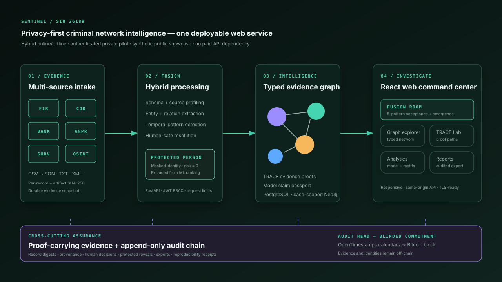
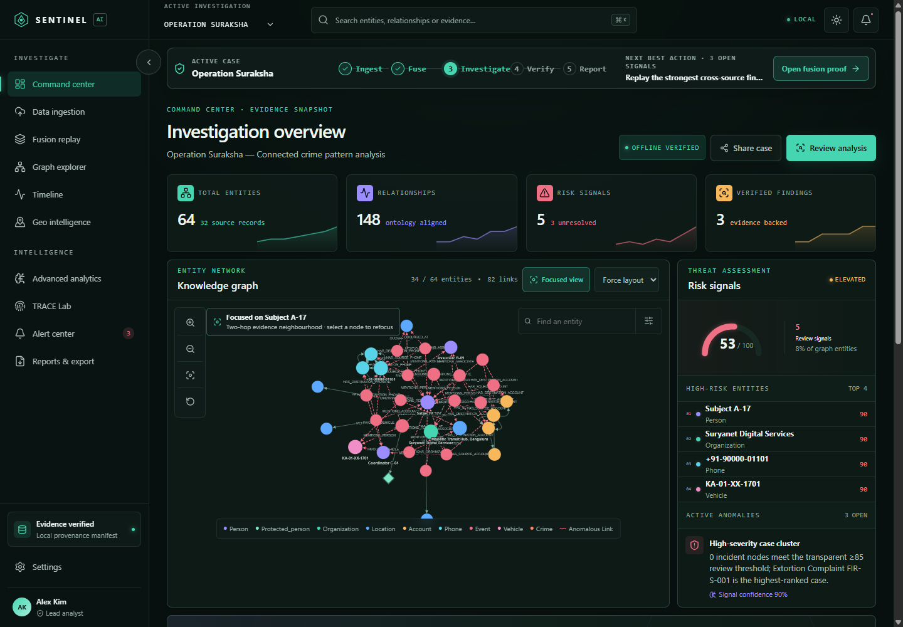
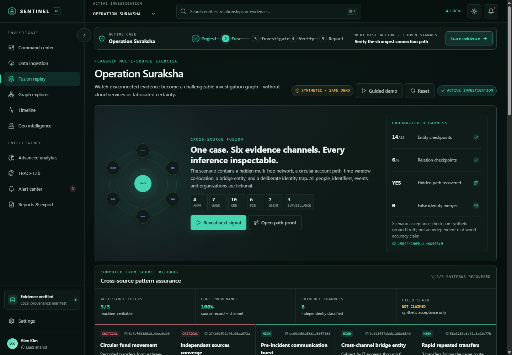
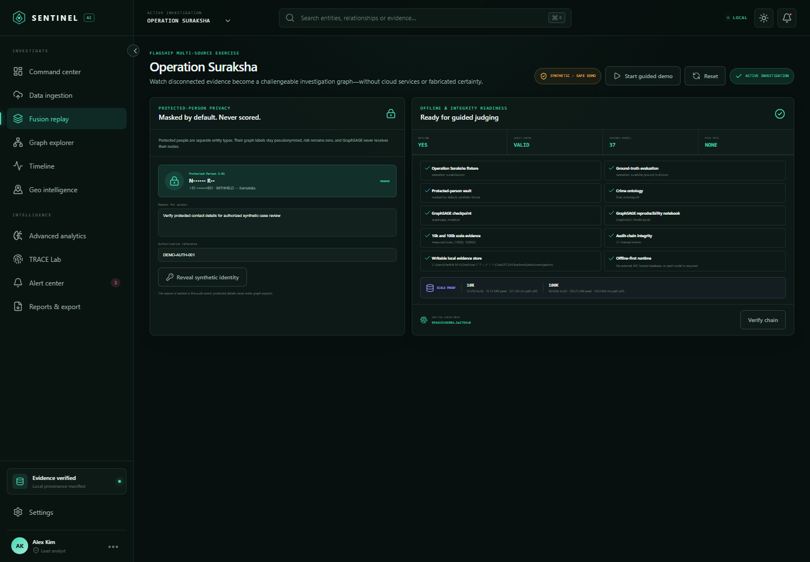
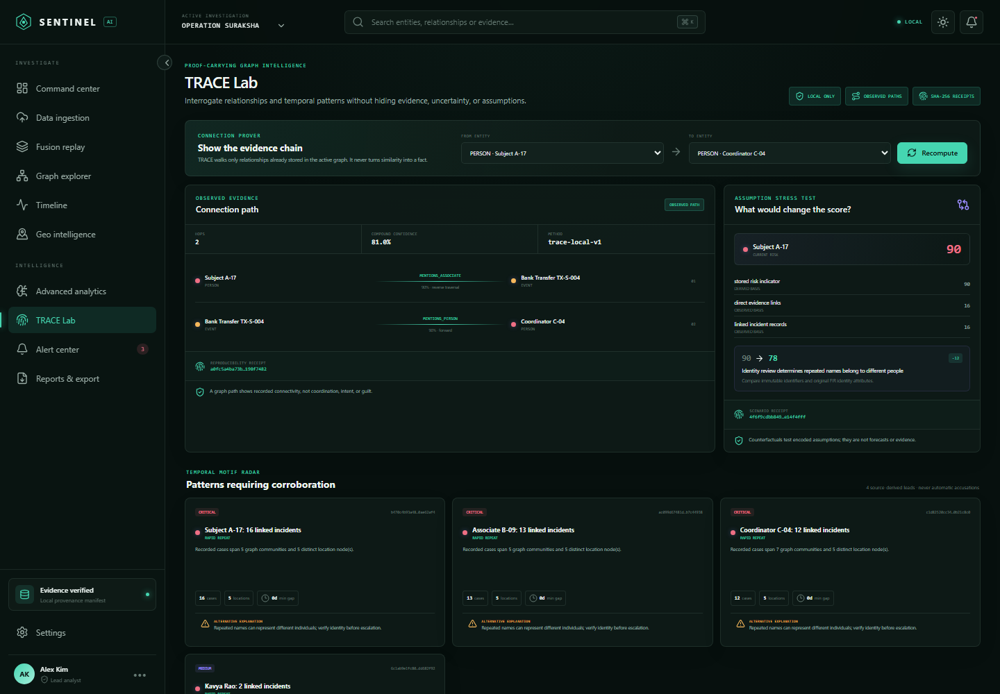

# Sentinel Knowledge Graph Investigation Platform

Sentinel is a full-stack investigation workspace that turns FIR narratives and structured crime records into an ontology-aligned knowledge graph. It combines a fast investigator-facing interface with a FastAPI service for ingestion, graph exploration, analytics, anomaly review, explanations, and export.

The September 2026 build is a hybrid online/offline investigative pilot—not a static prototype—that also deploys as one full-stack website. Core analysis requires no paid AI API or internet connection; optional online adapters add external verification without becoming evidence sources. Sentinel fingerprints every evidence artifact, separates observations from hypotheses, protects survivor identities, and keeps a human analyst in control of every consequential interpretation.

The repository opens with **Operation Suraksha**, a clearly labelled fictional Bengaluru-area exercise built to prove multi-source fusion safely:

- 32 synthetic records across FIR, CDR, banking, ANPR, surveillance, and OSINT-shaped evidence
- 64 typed entities and 148 source-linked relationships
- 14/14 entity and 6/6 relationship acceptance checkpoints recovered
- five computed cross-source/temporal patterns, one hidden path, and one deliberate false-identity-merge trap
- record-level provenance on all 148 relationships, including source channel, record ID, timestamp, and SHA-256 digest
- two protected-person nodes that remain pseudonymized, fixed at risk 0, and excluded from model inference
- a six-stage judge replay, reset/readiness controls, and deterministic receipts



## Product screenshots

| Operation Suraksha command center | Six-source Fusion Room |
| --- | --- |
|  |  |

| Protected-person privacy and audit readiness | TRACE evidence path |
| --- | --- |
|  |  |

The supplied Chicago crime corpus remains available as **Operation City Shield**, a larger validation investigation:

- 500 FIR narratives
- 500 structured crime records
- 434 unique named suspects
- 104 extracted vehicle plates
- 462 location blocks and 22 police beats
- 8 crime categories
- the source and populated WebProtégé crime ontologies

## Run locally

Prerequisites: Node.js 20+ and Python 3.11+.

```powershell
npm run install:all
npm run dev
```

Open [http://localhost:5173](http://localhost:5173). The API is at [http://localhost:8000](http://localhost:8000), and its interactive OpenAPI documentation is at [http://localhost:8000/docs](http://localhost:8000/docs).

The frontend has a deterministic fallback dataset, so it still renders if the API is temporarily unavailable. Start just the UI with `npm run dev:frontend` or just the API with `npm run dev:api`.

## Deploy the complete website

The root `Dockerfile` compiles React and serves the entire UI plus FastAPI from one URL. `render.yaml` configures the live, login-protected competition deployment at [sentinel-sih-26189-harthik.onrender.com](https://sentinel-sih-26189-harthik.onrender.com). The complete ingestion and analysis workflow is available through the public URL after authentication; generated passwords stay in Render environment secrets and are never committed. See [`docs/DEPLOYMENT.md`](docs/DEPLOYMENT.md).

## Run the complete stack

Docker Compose starts the web app, API, Celery worker, PostgreSQL, Neo4j, and Redis:

```powershell
docker compose up --build
```

Services:

| Service | Address | Purpose |
| --- | --- | --- |
| Web app | `localhost:5173` | React investigator console |
| API | `localhost:8000` | FastAPI + WebSockets |
| API docs | `localhost:8000/docs` | OpenAPI explorer |
| Neo4j Browser | `localhost:7474` | Graph database console |
| Neo4j Bolt | `localhost:7687` | Graph driver connection |

Copy `.env.example` to `.env`, replace both passwords and the signing secret, then start the stack. This private profile requires login, applies analyst/supervisor authorization, stores operational state in a named Docker volume, catalogues investigations in PostgreSQL, and mirrors each case into an isolated Neo4j subgraph.

## Product capabilities

- Drag-and-drop CSV, JSON, TXT, XML, RDF, and TTL ingestion
- Five-stage processing with real source profiling, SHA-256 fingerprints, streamed logs, and measured graph output
- Automatic FIR narrative extraction plus explicit field mapping for CDR, transaction, surveillance, and OSINT-shaped CSV/JSON records
- Managed PostgreSQL-backed investigation snapshots with an active-investigation selector; a processed graph immediately drives every downstream view
- Operation Suraksha Fusion Room: a six-stage cross-source replay, synthetic ground-truth scorecard, hidden-network reveal, and safe entity-resolution decision control
- Deterministic fusion assurance: communication bursts, repeated transfers, directed account cycles, time/location convergence, and cross-channel bridge detection computed from source records
- Temporal graph emergence: day-by-day reconstruction of evidence, entities, relationships, channels, and newly detectable patterns
- Protected-person privacy mode: separate entity type, masked default, zero criminal-risk score, ML/ranking exclusion, reasoned ephemeral reveal, and audit receipt
- Append-only SHA-256 audit chain covering uploads, activations, identity decisions, protected reveals, alert acknowledgement, exports, and demo resets
- Optional OpenTimestamps/Bitcoin audit-head checkpoints with nonce blinding, downloadable checkpoint + `.ots` proof, pending/confirmed state separation, and independent-header verification
- Repeatable demonstration controls with stage-one start, safe reset, hybrid readiness, and integrity verification
- Reproducible 10k/100k synthetic scale benchmark with build time, throughput, Python allocation peak, search latency, and path latency
- Interactive Cytoscape knowledge graph with a readable two-hop focused view, full-network toggle, contextual search, type filters, layouts, zoom, and entity dossiers
- Source-derived timeline and police-beat concentration views with non-GPS proxy coordinates labelled explicitly
- Active-graph risk scoring, anomaly triage, durably persisted alert acknowledgement, and natural-language explanations
- Key-individual rankings using degree, deterministic sampled betweenness, reach, and composite influence
- Communities, type distributions, exact degree distribution, modularity, and clearly labelled topology visualization
- GraphSAGE suspect-risk feature preparation, checkpoint inference, held-out proxy evaluation, and a model claim passport that blocks field-accuracy claims
- Expandable finding rationale with source records, alternatives, limitations, and human-review actions
- Evidence Trust Center with data-quality, provenance, model-readiness, and decision-policy gates
- Transparent case↔subject link hypotheses whose supporting feature overlaps are inspectable
- TRACE proof-carrying intelligence with observed connection paths, temporal motifs, counterfactual risk checks, explicit alternative explanations, and deterministic SHA-256 receipts
- Conservative entity resolution that surfaces supporting and conflicting signals, prevents name-only auto-merges, and reserves identity decisions for humans
- JSON, GraphML, STIX 2.1, CSV, GeoJSON, and generated PDF exports
- Persistent case workflow showing the active case, investigation stage, open-signal count, and one next-best action on every route
- Projector-readable hierarchy, stronger contrast, 40–44 px controls, keyboard search, skip navigation, labelled filters, browser history, and responsive layouts verified at a 430 px viewport
- Dark/light themes, recoverable lazy-module failures, and locally persisted workspace preferences
- Signed JWT sessions, analyst/supervisor route enforcement, audited login, password-hash support, and a secure hosted login screen
- Request rate limiting, request IDs, liveness/readiness probes, Prometheus-compatible metrics, CSP/HSTS headers, and CSV-formula neutralization
- Bounded text ingestion that rejects executable/archive masquerading, binary NUL content, XML entity declarations, oversized records, columns, and fields
- Hosted PostgreSQL investigation catalogue and digest-verified object store, optional case-scoped Neo4j mirroring, atomic execution cache, and verified backup script
- Redis/Celery worker seam and Docker deployment

## Data and ontology integration

The flagship scenario lives in [`backend/data/operation_suraksha.json`](backend/data/operation_suraksha.json), with its separately declared acceptance truth in [`backend/data/operation_suraksha_ground_truth.json`](backend/data/operation_suraksha_ground_truth.json). The runtime builds the graph from those records; replay and evaluation values are computed from the resulting graph rather than hard-coded success counters. The scenario is fictional and must never be represented as NCRB case data.

The same active-graph pipeline also reads [`backend/data/crime_dataset.csv`](backend/data/crime_dataset.csv) for Operation City Shield and maps each record to the supplied ontology:

```text
CrimeIncident ──HAS_SUSPECT────────> Suspect
      │                                  │
      ├──HAS_CRIME_TYPE──> CrimeType     └──DRIVES_VEHICLE──> Vehicle
      ├──OCCURRED_AT─────> Location
      └──OCCURRED_IN_BEAT> PoliceBeat
```

Risk is deliberately explainable. It starts from offense severity, then applies explicit adjustments for armed descriptions, arrest state, domestic-dispute markers, repeat subjects, and repeat locations. The output is suitable for analyst prioritization, not automated guilt or enforcement decisions.

The original supplied scripts are preserved in `backend/reference/`. The runtime adapter fixes a defect in the original graph builder where a vehicle node was created outside the `vehicle_plate` conditional; records without a plate could otherwise reference an undefined or stale `plate` value.

## GraphSAGE model integration

The supplied [`GraphSAGE_Model.ipynb`](backend/models/GraphSAGE_Model.ipynb) is integrated as a two-layer suspect classifier with the exact notebook schema: six one-hot ontology node types plus normalized node degree, 32 hidden channels per layer, and `normal` / `suspicious` outputs. Its source graph and the separately supplied link-prediction JSON are preserved alongside it in `backend/models/`.

The originally supplied bundle did not contain the checkpoint referenced by the notebook. A fresh `graphsage_model.pt` was therefore reproduced from the notebook architecture and matching source graph with a fixed split seed (`42`) and model seed (`1`). The notebook's perfect structural-proxy score is retained only inside reproduction metadata; it is not used as Sentinel's performance headline. The target is derived from the same topology used as input, and the reported partition was also used for checkpoint selection. This is a reproduction, not the notebook author's original serialized state.

`/api/analytics/graphsage` performs real CPU inference whenever the checkpoint and PyTorch Geometric runtime are available. A compact NumPy weight artifact provides an equivalent two-layer mean-aggregator forward pass in the web container without shipping the heavyweight training stack. Out-of-training-schema graphs still return a clearly labelled structural preview—never fabricated model probabilities. PyTorch checkpoints are loaded with `weights_only=True`.

```powershell
npm run install:ml
python backend/scripts/train_graphsage.py --epochs 200 --seed 1
```

`python backend/scripts/evaluate_model.py` now produces a machine-readable leakage audit, quarantines the perfect result as a checkpoint-reproduction diagnostic, compares fixed transparent baselines, and runs ten deterministic trials with 20% of person-case evidence links masked. That robustness diagnostic currently yields mean proxy F1 `0.825` (range `0.780–0.849`) and mean Brier score `0.103`; it is still not field validation. The UI leads with **field accuracy: not established**, not the perfect reproduction number. The accompanying [`docs/MODEL_CARD.md`](docs/MODEL_CARD.md) records the release gate. Model outputs are decision support for analyst review and are not evidence of guilt.

## Evidence integrity and responsible analysis

`/api/provenance/manifest` creates a local chain-of-custody manifest for the dataset, FIR corpus, ontology, model graph, training notebook, reproduced checkpoint, and supplied output. Each entry includes its complete SHA-256 digest, byte size, modification time, role, and a [W3C PROV-O](https://www.w3.org/TR/prov-o/) compatible type. Separately, `/api/audit/verify` validates the append-only action chain by recomputing every content hash and previous-hash link. The optional `/api/audit/anchors` workflow submits only a nonce-blinded checkpoint commitment to OpenTimestamps calendars and can later verify the upgraded proof against a Bitcoin block header. [`docs/LEDGER_DECISION.md`](docs/LEDGER_DECISION.md) documents the threat model, privacy boundary, proof states, and exact claim limit.

The platform maintains explicit epistemic boundaries:

- observed source fields and direct counts are presented as evidence;
- rule-based scores and GraphSAGE outputs are presented as derived indicators;
- new links from `/api/analysis/link-candidates` are labelled hypotheses, not facts;
- the supplied 50-row link output is retained but marked non-actionable because all scores are identical and below threshold;
- every consequential finding includes alternative explanations and a required human verification step.
- every Operation Suraksha relationship carries its source-record identifier, channel, timestamp, and canonical record digest.

Both built-in investigations pass their schema-specific data-quality gates. Operation Suraksha additionally evaluates itself against a transparent synthetic ground truth; those checks establish scenario reproducibility, not real-world model accuracy.

## PS 26189 coverage

This build is mapped directly to the Ministry of Home Affairs / NCRB problem statement:

| Required capability | Implemented evidence |
| --- | --- |
| Process multiple sources | Working FIR/CDR/banking/ANPR/surveillance/OSINT synthetic exercise, CSV and JSON schema mapping, FIR text extraction, XML profiling, RDF/TTL semantic intake, SHA-256 provenance |
| Extract people, places, vehicles, phones, and organizations | Typed ontology nodes for `person`, `protected_person`, `location`, `vehicle`, `phone`, `organization`, `account`, `event`, and `crime` |
| Build relationship maps | Active Cytoscape graph plus JSON/GraphML/STIX 2.1 export and ontology-labelled predicates |
| Identify key individuals | Person-filtered degree, sampled betweenness, neighborhood reach, and composite influence rankings |
| Detect suspicious patterns | Transparent risk rules, time-window convergence, account-cycle replay, repeat-entity and concentration alerts, GraphSAGE inference, and explainable link candidates |
| Give actionable investigator insight | Evidence-backed brief, alternatives, provenance, timeline, concentration grid, source links, and required human next actions |

The detailed verification matrix is in [`docs/PS_26189_COMPLIANCE.md`](docs/PS_26189_COMPLIANCE.md).
The GitHub, research-paper, and dataset landscape behind the differentiation strategy is in [`docs/RESEARCH_AND_INNOVATION.md`](docs/RESEARCH_AND_INNOVATION.md).
Measured results and an honest category comparison are in [`docs/SUBMISSION_EVALUATION.md`](docs/SUBMISSION_EVALUATION.md); clean rehearsal steps are in [`docs/CLEAN_INSTALL_CHECKLIST.md`](docs/CLEAN_INSTALL_CHECKLIST.md).

## Important paths

```text
frontend/src/
├── components/              Investigator UI modules
├── data/mockData.ts         Offline UI fallback
├── api.ts                   Typed API adapter
└── styles.css               Responsive design system

backend/
├── app/main.py              REST, WebSocket, analytics, and exports
├── app/crime_pipeline.py    FIR extraction and graph construction
├── app/investigation_store.py Active-graph workspace with durable adapters
├── app/network_intelligence.py Source-derived topology, timeline, map, and alerts
├── app/trace_engine.py        Proof paths, temporal motifs, counterfactuals, receipts
├── app/suraksha.py            Flagship replay, ground-truth evaluation, identity controls
├── app/protected_persons.py    Masked vault and reasoned ephemeral disclosure
├── app/audit_log.py            Append-only SHA-256 action chain
├── app/security.py             JWT authentication, PBKDF2 and role enforcement
├── app/operations.py           Rate limiting, request telemetry and metrics
├── app/readiness.py            Offline release gate and benchmark discovery
├── app/database.py             Hosted PostgreSQL state + optional Neo4j mirror
├── app/celery_app.py        Redis/Celery task entry point
├── data/                    Synthetic flagship fixtures plus supplied CSV/FIR corpus
├── models/                     GraphSAGE notebook, graph, outputs, and checkpoint
├── benchmarks/                 Measured scale and model-evaluation artifacts
├── ontology/                Source and populated TTL ontologies
└── reference/               Original supplied Python scripts
```

## API overview

The API includes all requested route groups:

- `/api/upload`, `/api/uploads`, `/api/upload/{id}`
- `/api/pipeline/start`, `/api/pipeline/status/{id}`, `/api/pipeline/stream/{id}`
- `/api/graph/nodes`, `/api/graph/edges`, `/api/graph/subgraph`, `/api/graph/search`, `/api/graph/metrics`
- `/api/investigations`, `/api/investigations/active`, `/api/investigations/{id}/activate`
- `/api/demo/suraksha/replay`, `/api/demo/suraksha/evaluation`, `/api/demo/suraksha/fusion-assurance`, `/api/demo/suraksha/emergence`
- `/api/demo/suraksha/reset`, `/api/system/readiness`, `/api/benchmarks/scale`, `/api/benchmarks/model`
- `/api/protected-persons`, `/api/protected-persons/{id}/reveal`, `/api/audit`, `/api/audit/verify`
- `/api/entity-resolution/candidates`, `/api/entity-resolution/{id}/decision`
- `/api/analytics/centrality`, `/api/analytics/key-individuals`, `/api/analytics/community`, `/api/analytics/embeddings`, `/api/analytics/distribution`, `/api/analytics/trends`, `/api/analytics/graphsage`
- `/api/analysis/anomalies`, `/api/analysis/risk-scores`, `/api/analysis/link-predictions`, `/api/analysis/link-candidates`, `/api/analysis/briefing`, `/api/analysis/explanations/{id}`
- `/api/analysis/connection-path`, `/api/analysis/motifs`, `/api/analysis/counterfactual/{id}`, `/api/analysis/trace/{id}`
- `/api/visualization/graph`, `/api/visualization/timeline`, `/api/visualization/locations`, `/api/visualization/heatmap`
- `/api/export/graph/json`, `/api/export/graph/graphml`, `/api/export/graph/stix`, `/api/export/report/pdf`, `/api/export/data/csv`, `/api/export/geojson`
- `/api/data/quality`, `/api/provenance/manifest`
- `/api/config`, `/api/models`, `/api/models/graphsage/status`, `/api/ontology/summary`, `/api/auth/login`, `/api/auth/me`
- `/api/health/live`, `/api/health/ready`, `/api/system/metrics`, `/metrics`

## September 2026 frontend baseline

The UI uses React 19.2.8. Vite is pinned to the supported 6.4 security-maintenance line because the target machine currently runs Node 20.16; this avoids requiring a machine-wide Node upgrade while retaining security patches. Vitest 3.2.7 replaces the vulnerable older test runtime, and `npm audit` reports zero known frontend dependency vulnerabilities. The final-round UX pass also verifies all eleven routes at a true 430 px viewport with no document-level horizontal overflow or visible interactive target below 40 px.

## Tests

```powershell
npm test
```

This runs the frontend component tests and backend API tests. A production frontend build can be checked separately with `npm run build`, or run the complete release gate with `powershell -ExecutionPolicy Bypass -File scripts/verify_release.ps1`.

The `Sentinel live deployment smoke test` workflow runs after every successful `master` release check, once daily, and on demand. It waits for Render to expose the triggering Git SHA, verifies readiness, signs in through repository-held analyst secrets, checks the six-stage Operation Suraksha replay, verifies the audit chain, downloads and validates a real PDF report, and confirms that the export advanced the valid audit chain. Each successful run retains a non-secret receipt for 14 days; the report is hashed and discarded instead of being copied into GitHub artifacts. Configure `SENTINEL_SMOKE_EMAIL` and `SENTINEL_SMOKE_PASSWORD` as GitHub Actions repository secrets; never commit them.

## Production notes

The live Render application uses managed PostgreSQL for its case catalogue and digest-verified durable object store. Uploaded sources, investigation snapshots, the active-case registry, audit chain, identity decisions, runtime controls, timestamp checkpoints and proofs are restored into the web service's local execution cache after a restart. The optional self-hosted profile additionally mirrors case-scoped graph topology into Neo4j. A separate GitHub Actions job verifies both PostgreSQL restoration and real PostgreSQL/Neo4j case isolation on every release. See [`docs/SECURITY_OPERATIONS.md`](docs/SECURITY_OPERATIONS.md) for credentials, backup, monitoring and the remaining agency-accreditation boundary.
